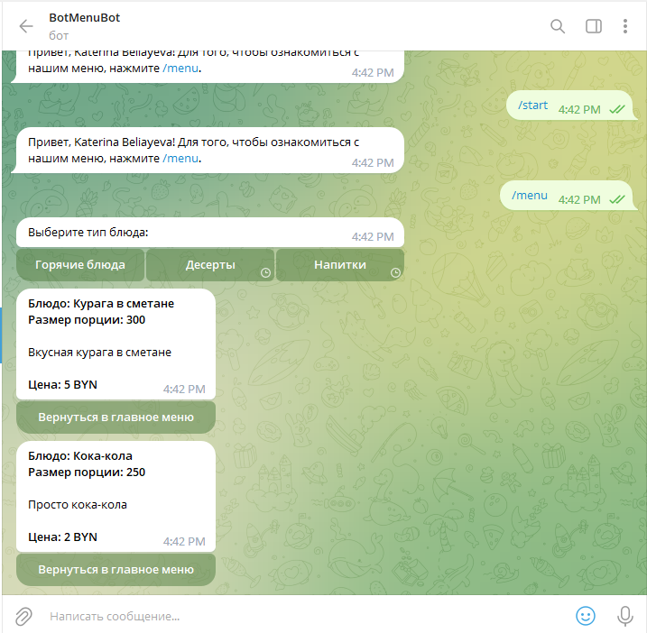

# Menubot + NoSQL Firestore

Телебот выполнен при помощи:

- Python 3.10
- pyTelegramBotAPI 4.7
- Firebase

Принцип действия:

Чат бот просит выбрать категорию меню, после чего обращается к БД и выводит блюда с описанием и ценами в чате.
